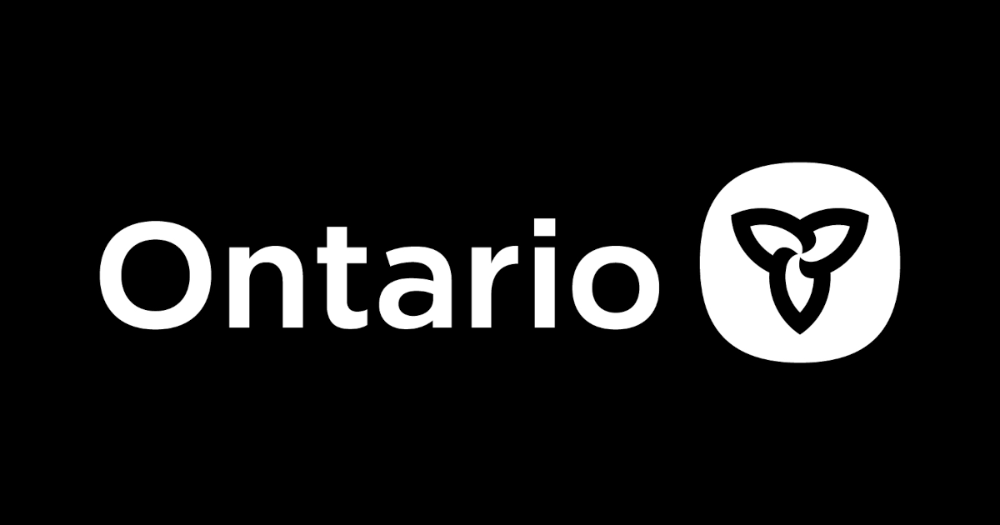

# @ongov/ontario-frontend

The `ontario-frontend` package is a part of the Ontario.ca Frontend monorepo and a core dependency for developing digital services within the Ontario Government's digital ecosystem. It provides developers with a robust set of tools, configurations, and templates aimed at facilitating the creation of accessible, efficient, and consistent web experiences. Built on top of popular web development tools such as [Eleventy](https://www.11ty.dev/) and [Nunjucks](https://mozilla.github.io/nunjucks/), this framework offers a comprehensive solution for rapid development without sacrificing quality or performance.

## Table of Contents

- [Features](#features)
- [Usage](#usage)
- [Installation](#installation)
- [Development](#development)
- [Documentation](#documentation)
- [Contributing](#contributing)
- [License](#license)
- [Versioning](#versioning)

## Features

- **Eleventy configurations**: Optimized configurations for Eleventy, designed to streamline the development of static sites with enhanced performance and scalability.

- **Nunjucks templating**: A rich set of Nunjucks templates and macros that promote reusability and maintainability across various projects, enabling developers to craft dynamic content with ease.

- **Custom filters**: A collection of custom Nunjucks filters tailored to meet the unique requirements of government digital services, facilitating common tasks such as date formatting, text transformations, and more.

- **Utility functions**: Handy utilities for common calculations, configurations, and other helper functions that simplify complex tasks and improve developer productivity.

## Usage

This package is a core dependency for Ontario.ca Frontend applications and projects. As such, it is best to create a new Ontario.ca Frontend project using the [ontario-frontend-cli's](https://github.com/ongov/ontario-frontend/tree/main/packages/ontario-frontend-cli) `ontario-create-app` command. This package will be automatically added to your Ontario.ca Frontend project when it is created that way.

It is possible to include this package and leverage the Eleventy configurations in an existing project not created with the Ontario.ca Frontend, but this is an unsupported method.

### Usage prerequisites

Ensure you have Node.js and npm installed on your machine. This framework is built to work with Eleventy, so familiarity with Eleventy and Nunjucks is recommended.

## Installation

1. Add the framework as a dependency to your project:

    ```bash
    npm install @ongov/ontario-frontend
    ```

2. Configure Eleventy to use the framework's settings and Nunjucks environment:

    ```javascript
    // .eleventy.js
    const ontarioFrontendFramework = require('@ongov/ontario-frontend');

    module.exports = function(eleventyConfig) {
    // Apply the framework's configurations
    ontarioFrontendFramework.configureEleventy(eleventyConfig);
    };
    ```

3. Start building your project with the provided templates and utilities.

## Development

### Getting started

These instructions will get you a copy of the project up and running on your local machine for development and testing purposes.

#### Prerequisites

- [Node.js](https://nodejs.org) (Version specified in `.nvmrc`)
- [pnpm](https://pnpm.io)

Refer to the main [monorepo README](https://github.com/ongov/ontario-frontend/tree/main) for detailed setup instructions and prerequisites.

#### Clone and install

1. Clone the monorepo (if you haven't already):

    ```bash
    git clone -b main https://github.com/ongov/ontario-frontend.git
    cd ontario-frontend
    ```

2. Navigate to the `ontario-frontend` package:

    ```bash
    cd packages/ontario-frontend
    ```

3. Install dependencies using pnpm:

    ```bash
    pnpm install
    ```

#### Working locally

To work with this package locally as a dependency:

```bash
pnpm link
```

This will make the current local package accessible system-wide, or in another location.

## Documentation

Explore the documentation to learn about every aspect of the toolkit--from installation and file structure to adding analytics and preparing for deployment. The documentation is available at [developer.ontario.ca](https://developer.ontario.ca).

## Contributing

Contributions to the [Ontario.ca Frontend](https://github.com/ongov/ontario-frontend/tree/main/packages/ontario-frontend) are welcome. Whether it's bug reports, feature requests, or contributions to code, we appreciate your input.

Check out our [CONTRIBUTING.md](https://github.com/ongov/ontario-frontend/tree/main/CONTRIBUTING.md) file for guidelines on how to contribute.

## License

This project is licensed under the [Open Government Licence - Ontario](https://www.ontario.ca/page/open-government-licence-ontario). Feel free to use, modify, and distribute it as needed.

## Versioning

We use [SemVer](http://semver.org/) for versioning. For the versions available, see the [tags on this repository](https://github.com/ongov/ontario-frontend/tags).
